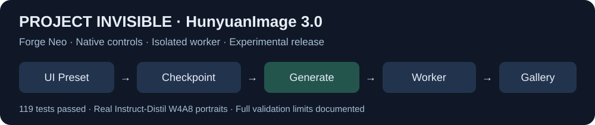

# Project Invisible — HunyuanImage 3.0

Tencent HunyuanImage 3.0 through Forge Neo's normal **UI Preset → Checkpoint → Generate** workflow. Supports the converted Base, Instruct and Instruct-Distil checkpoints, text-to-image, Instruct image editing with up to three references, prompt rewriting and optional Spectrum.

No extra page, Forge core edits, ComfyUI server or separate virtual environment. A dedicated process uses Forge's Python and bundled, pinned Comfy model code. Its packages stay in this extension's `vendor/python`. Generate does not download anything. Closing the worker frees its model memory.

**Experimental release:** 119 standalone tests pass. Real image generation is verified only for Instruct-Distil W4A8. The 8/10/12 GB budget simulations passed on RTX 5090; the 16 GB profile currently fails a host-buffer transfer, and explicit 24/32 GB profiles remain unverified. Use Low memory or the tested 12 GB profile for conservative operation. Physical smaller GPUs and full-model GGUF remain unverified. See [VALIDATION.md](VALIDATION.md).

## Start

1. Put this complete folder in Forge Neo's `extensions` folder. Restart Forge and refresh the browser. The installer downloads only small worker packages.
2. Add the converted model and VAE below. Choose **HunyuanImage 3.0** in **UI Preset**.
3. Use Forge's normal **Checkpoint** selector. Its native refresh button discovers Hunyuan checkpoints and adds compatible components to **VAE / Text Encoder**. Automatic selection resolves matching companions; choose explicit files in the native component selector when needed. The Project Invisible marker automatically chooses the first discovered model.
4. Start with **1024 × 1024**, **Euler**, **Simple** and an empty negative prompt. Click normal **Generate**. Normal **Stop**, gallery and sample saving are connected.

| Model | Steps | CFG | Distilled CFG |
|---|---:|---:|---:|
| Instruct-Distil | 8 | 1 | 2.5 |
| Instruct | 50 | 2.5 | unused |
| Base | 50 | 5 | unused |

The preset starts with Instruct-Distil settings. Set the table values when choosing another variant. The worker enforces 8 steps/CFG 1 for Distil and reports the effective settings in image metadata.

## Model files

Use Pedro Marinho's converted safetensors. Original Tencent sharded checkpoints are not accepted. An experimental GGUF loader accepts only the same native HunyuanImage 3 tensor names, expert ordering and sampling contract; generic llama, HunyuanVideo or Flux GGUF files are incompatible.

| Task | Files |
|---|---|
| Text-to-image | `hunyuan_image_3_<variant>_w4a8.safetensors` and `hunyuan_image_3_vae_fp16.safetensors` |
| Image editing | Above plus `hunyuan_image_3_<variant>_siglip2_so400m_naflex.safetensors` |
| Prompt rewriting | Above plus `hunyuan_image_3_<variant>_cot_head.safetensors` |

Variants: `instruct_distil`, `instruct`, `base`. W4A8, int8 ConvRot and BF16 follow the bundled upstream loader. The text tokenizer is bundled; there is no separate text encoder. Auto vision selection must match the model variant. Base supports text-to-image only.

Quantization preflight also recognizes native Comfy W6A8, INT8, ConvRot W4A4, FP8 E4M3/E5M2, MXFP8 and NVFP4 metadata. It checks the actual GPU's compute support and rejects unsafe whole-bank fallbacks. This is format support, not proof that every quantized checkpoint has been tested. Only Instruct-Distil W4A8 has full local image evidence. GGUF operations have CPU tests; no complete real GGUF model was available for generation verification. GGUF dequantizes selected matrices/experts with bounded caches and does not convert the entire 80B model to BF16.

Put files under `models/HunyuanImage3/`; subfolders are fine. Existing `models/Stable-diffusion`, `diffusion_models`, `VAE`, `vae` and `clip_vision` folders are also scanned. Add other absolute locations to `model_roots` in `config.json`. Keep Hunyuan's filenames so scanning and companion matching remain reliable.

- [Instruct-Distil weights](https://huggingface.co/PedroMarinhoDev/HunyuanImage-3.0-Instruct-Distil-ComfyUI)
- [Instruct weights](https://huggingface.co/PedroMarinhoDev/HunyuanImage-3.0-Instruct-ComfyUI)
- [Base weights](https://huggingface.co/PedroMarinhoDev/HunyuanImage-3.0-Base-ComfyUI)

W4A8 alone is about 44 GiB. Upstream measured around 50 GB system RAM occupied. Use a fast SSD and sufficient free RAM; this extension has not reproduced upstream image or speed benchmarks.

## Editing and advanced controls

Use Forge **img2img** for the first image; add **Reference 2/3** in the Hunyuan panel. Set **Denoising strength = 1**. Refer to the first, second or third image in the prompt. The output follows Forge's width/height controls.

Prompt rewriting is off by default and can be slow. Spectrum is optional and changes the image; it is off by default. **Keep model loaded** avoids reloading between runs but holds system RAM. Switching presets, changing selected components or pressing Stop releases the owned worker.

**Speed / memory** selects a policy:

| Mode | Behavior |
|---|---|
| Balanced | Automatic card profile, warm model cache and async streaming; idle GPU weights may be offloaded |
| Speed | Retain model/GPU cache for faster repeated images; may occupy almost all VRAM |
| Low memory | On this 32 GiB card target an ~8 GiB working pool, use tiled VAE decoding and release the worker after each request |

**VRAM profile** defaults to Automatic, or choose 8, 10, 12, 16, 24 or 32 GB. Explicit smaller profiles simulate that budget on a larger GPU. They never increase the actual card's available memory or force a resolution change.

| Card profile | Total GPU working target | VAE tiling |
|---|---:|---|
| 8 GB | 6.0 GiB | automatic |
| 10 GB | 8.0 GiB | automatic |
| 12 GB | 9.5 GiB | automatic |
| 16 GB | 13.0 GiB | optional |
| 24 GB | 20.0 GiB | optional |
| 32 GB | 27.5 GiB | optional |

These are headroom policies rather than hard allocator limits; short temporary allocations can exceed the target. Profiles below 12 GB are experimental, and software-budget checks on a 32 GB RTX 5090 do not verify actual 8/10 GB hardware. Start with W4A8, single-image batches and the recommended size. System RAM remains about 55–58 GiB in local W4A8 tests regardless of the GPU profile. Small profiles avoid full unquantized expert-bank staging where a selected-expert path is available.

Keep-model caching is enabled in the new UI. Cache expires after 180 idle seconds and is released if free system RAM falls below 8 GiB. These values are configurable as `cache_idle_seconds` and `cache_ram_floor_gib`. **Advanced → Unload model now** releases the cache immediately. Selecting the same model again preserves it.

Image metadata records sampled total GPU peak, worker RAM peak, warm-cache use, mode, quantization and applied adapters. Total GPU usage includes other applications; Torch allocator measurements are reported separately in worker results because dynamic VRAM allocations are not all owned by Torch. Memory sampling is every 100 ms and may miss shorter spikes.

## LoRA and other adapters

Use Forge's normal `<lora:name:strength>` or `<lyco:name:strength>` prompt tags and place compatible files in `models/Lora` or `models/LyCORIS`. Set extra local locations in `adapter_roots`. Duplicate names require a relative subfolder name. No separate adapter dropdown is added.

The integration handles compatible LoRA, LoCon, LoKr, LoHa, DoRA, OFT and BOFT through Comfy's adapter registry. It supports native converted names, common PEFT aliases, fused Q/K/V and split expert gate/up targets. Targets and shapes are checked before registering changes. Cached base weights are preserved between adapters, and stale patches are removed on changes.

Expert adapters use factor operations where possible. Other supported expert updates use one bounded selected-expert matrix, with no whole-bank merging. These matrix-based adapters can be slower and their safety budget can reject oversized updates. Tensor layouts unsupported by the underlying registry remain explicit errors. LoRA/LoKr have local synthetic-weight GPU generation evidence; other forms have CPU numerical coverage rather than learned-adapter image-quality evidence. Synthetic fixtures are tests, not trained style/identity adapters.

Use dimensions divisible by 16, from 256 to 2048 on each side, with total area no greater than 1536². Larger images should be produced with a separate upscale workflow.

Hires fix, masks/inpainting, seamless tiling, face restoration, variation seeds, hypernetworks and native sampling extensions are not supported in this worker route. Generation rejects these controls rather than silently ignoring them. Tiled VAE decoding is a separate memory feature and is supported. External script callbacks and refiner features require their own compatible integration.

## Checks and troubleshooting

See [VALIDATION.md](VALIDATION.md). Three real Instruct-Distil W4A8 human portraits passed Forge API generation, sample saving and metadata checks at 1024 × 1024 and 1024 × 1536. Visual inspection found convincing faces and proportions, with softer finger detail. Other model variants remain unverified. Later isolated editing checks produced the requested colour change but also excessive contrast and texture; editing quality remains unresolved. See the later editing checks in VALIDATION.md. Missing weights produce a specific file message before allocating model memory. Worker failures are recorded in `logs/worker.log`. File selectors remain hidden to preserve existing saved/API argument positions; ordinary UI selection uses Forge's native controls.

Run `tools/check_worker.py` with Forge's Python to check the backend without loading weights. Run `tools/test.py` for standalone tests. If installing manually, run `install.py` with Forge's Python; it preserves shared Torch and other Forge packages.

## Credits and source

- **Tencent Hunyuan** — model, tokenizer and model terms.
- **Pedro Marinho / ComfyUI-HunyuanImage3** — native model port, quantized expert banks, VAE, image conditioning, rewriting and Spectrum integration.
- **ComfyUI contributors** — sampling, memory management and dynamic VRAM.
- **Haoming02 / Forge Neo** and the original Forge/AUTOMATIC1111 contributors.
- **Project Invisible / Siddharth Mishra** — Forge extension integration philosophy; H3 and Qwen extensions informed the native control pattern.

Bundled revisions are recorded in `vendor/revisions.json`. Upstream sources and licenses remain under `vendor/hunyuan` and `vendor/ComfyUI`; the extension distribution is GPL-3.0. Model files retain Tencent's separate model terms. See [NOTICE](NOTICE).
